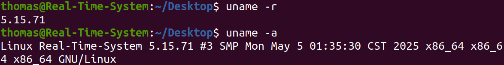
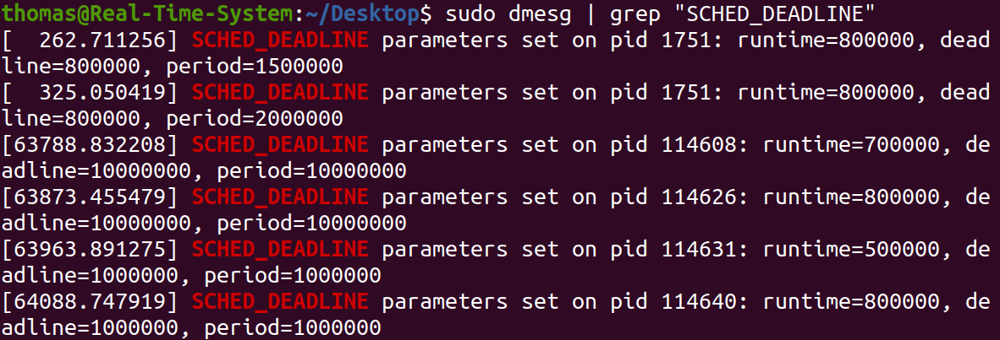
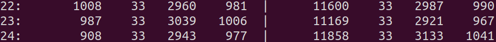
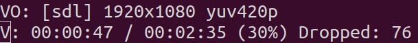
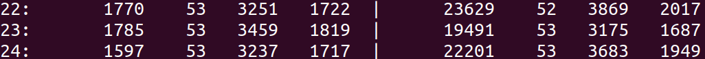
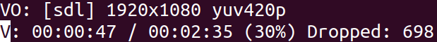
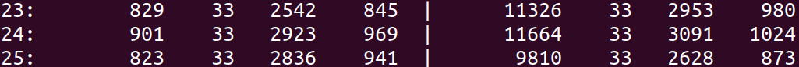
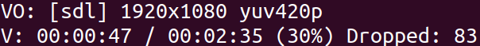
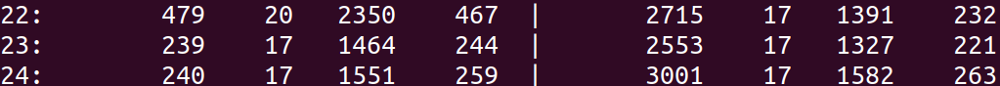
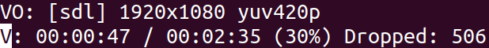

RTS Project 1
---

> R12944024 王行悌

## Environment Setup
- VirtualBox: [Download](https://www.virtualbox.org/wiki/Downloads)
- Ubuntu 20.04 LTS (or newer): [Download](https://ubuntu.com/download/desktop)
- VM Spec:
  - Memory: 4096 MB
  - Disk: 64 GB
  - CPU: 1 core (i9-10900X CPU)

## Part I: Linux Kernel Building

### Kernel Compilation From Scratch
- **Step 1**: Install Required Packages
  ```sh
  $ sudo apt-get install build-essential libncurses5-dev flex bison libssl-dev libelf-dev dwarves zstd mpv
  ```

- **Step 2**: Download and Extract Kernel Source
  ```sh
  $ wget https://cdn.kernel.org/pub/linux/kernel/v5.x/linux-5.15.71.tar.xz
  $ tar xvf linux-5.15.71.tar.xz
  ```

- **Step 3**: Configure the Kernel
  ```sh
  $ cd linux-5.15.71
  $ make mrproper
  $ make menuconfig
  ```
  - In menuconfig, you can simply save and exit immediately to generate a `.config` file.
  - Then, edit `.config` directly to apply the required configuration (faster than navigating the UI).
    ```ini
    # Clear keys to avoid missing certificate errors
    CONFIG_SYSTEM_TRUSTED_KEYS=""
    CONFIG_SYSTEM_REVOCATION_KEYS=""
    # Disable BTF debug info
    # CONFIG_DEBUG_INFO_BTF is not set
    ```

- **Step 4**: Build & Install the Kernel
  ```sh
  $ make -j$(nproc)
  $ sudo make modules_install
  $ sudo make install
  ```
  - I initially assigned **multiple CPU cores** in VirtualBox to speed up kernel compilation. After building the kernel, I reduced the VM to a **single core** for scheduling analysis later in Part II.

- **Step 5**: Set GRUB
  ```sh
  $ sudoedit /etc/default/grub
  # Modify or add:
  # GRUB_TIMEOUT_STYLE=menu
  # GRUB_TIMEOUT=10
  $ sudo update-grub
  ```

- **Step 6**: Reboot and Verify
  - After completing kernel compilation and installation, reboot the system and select the newly installed kernel from the GRUB menu.
  - Once the system boots up, check the current kernel version:
    ```sh
    $ sudo reboot
    # after reboot
    $ uname -r
    # expected output: 5.15.71
    ```

    <br>

### Incremental Build
- When making changes (e.g., to `kernel/sched/deadline.c`), you don’t need a full rebuild:
  ```sh
  make -j$(nproc)
  sudo make modules_install
  sudo make install
  ```
- Then reboot to apply the changes.

## Part II: Linux Scheduling Policy Testing and Analysis
    
### Objective
- Observe the behavior of Earliest Deadline First (EDF) scheduling and compare it with other scheduling policies in Linux.
- By modifying the Linux kernel source file `kernel/sched/deadline.c`, we verify whether EDF parameters are correctly set and triggered during runtime.

### `chrt` Code Trace (v5.15.71)
- **Setting EDF using `chrt`**
  - The following command sets a specific process to use the `SCHED_DEADLINE` policy with custom runtime, deadline, and period:
    ```sh
    $ sudo chrt --all-tasks --deadline \
        --sched-runtime 700000 \
        --sched-deadline 10000000 \
        --sched-period 10000000 \
        -p <PID>
    ```
- **Call Chain Overview**
  ```text
  user space (chrt)
      ↓
  syscall: sched_setattr (or sched_setscheduler)
      ↓
  do_sched_setscheduler()
      ↓
  sched_setscheduler()
      ↓
  _sched_setscheduler()
      ↓
  __sched_setscheduler()
      ↓
  __setscheduler_params()
      ↓
  __setparam_dl()
  ```

- **Kernel Code Instrumentation**: To confirm that EDF parameters are properly applied, we inserted a debug message in `__setparam_dl()`:
  ```c
  // kernel/sched/deadline.c
  void __setparam_dl(struct task_struct *p, const struct sched_attr *attr)
  {
  	struct sched_dl_entity *dl_se = &p->dl;
  
  	dl_se->dl_runtime = attr->sched_runtime;
  	dl_se->dl_deadline = attr->sched_deadline;
  	dl_se->dl_period = attr->sched_period ?: dl_se->dl_deadline;
  	dl_se->flags = attr->sched_flags & SCHED_DL_FLAGS;
  	dl_se->dl_bw = to_ratio(dl_se->dl_period, dl_se->dl_runtime);
  	dl_se->dl_density = to_ratio(dl_se->dl_deadline, dl_se->dl_runtime);
  
    pr_info(
        "SCHED_DEADLINE parameters set on pid %d: runtime=%llu, deadline=%llu, period=%llu\n",
        p->pid,
        attr->sched_runtime,
        attr->sched_deadline,
        attr->sched_period
    );
  }
  ```
- **Verifying the Configuration**
  - After running the chrt command, use the following to check whether EDF parameters were successfully applied:
    ```sh
    $ sudo dmesg | grep "SCHED_DEADLINE"
    ```
  - If successful, the log should show the `pr_info()` output with the runtime, deadline, and period values.

    <br>

### Earliest Deadline First (EDF)
- I concurrently ran `7z` and `mpv`, assigning them the `SCHED_DEADLINE` policy using `chrt`, and observed how different scheduling parameters affected runtime behavior.
- **Equal Runtime Allocation**
  ```sh
  $ sudo chrt --deadline --sched-runtime 500000 --sched-deadline 1000000 --sched-period 1500000 -p 0 $(pgrep 7z)
  $ sudo chrt --deadline --sched-runtime 500000 --sched-deadline 1000000 --sched-period 1500000 -p 0 $(pgrep mpv)
  ```

  <br>

  <br>

  - Each process was given 33% of CPU time (runtime / period = 500us / 1500us)
  - CPU resources were evenly allocated. `mpv` played smoothly with minimal frame drops, and `7z` also executed normally.
- **Allocating More Runtime to `7z`**
  ```sh
  $ sudo chrt --deadline --sched-runtime 800000 --sched-deadline 1000000 --sched-period 1500000 -p 0 $(pgrep 7z)
  $ sudo chrt --deadline --sched-runtime 200000 --sched-deadline 1000000 --sched-period 1500000 -p 0 $(pgrep mpv)
  ```

  <br>

  <br>

  - `7z` was allocated 53% of CPU time, while `mpv` only had around 13%.
  - `mpv`'s playback became unstable, with a noticeable increase in dropped frames.
- **Shortening the Deadline for `mpv`**
  ```sh
  $ sudo chrt --deadline --sched-runtime 500000 --sched-deadline 1000000 --sched-period 1500000 -p 0 $(pgrep 7z)
  $ sudo chrt --deadline --sched-runtime 500000 --sched-deadline 500000 --sched-period 1500000 -p 0 $(pgrep mpv)
  ```

  <br>

  <br>

  - Even though `mpv` had a shorter deadline, its playback remained stable due to sufficient runtime and relatively low system load. The result was similar to the baseline.
- **Increasing the Period**
  ```sh
  $ sudo chrt --deadline --sched-runtime 500000 --sched-deadline 1000000 --sched-period 3000000 -p 0 $(pgrep 7z)
  $ sudo chrt --deadline --sched-runtime 500000 --sched-deadline 500000 --sched-period 3000000 -p 0 $(pgrep mpv)
  ```

  <br>

  <br>

  - Extending the period to 3ms reduced average CPU usage.
  - `mpv`'s playback has a noticeable increase in dropped frames.
  - `mpv` occasionally experienced audio-video desynchronization due to the latency.

### Comparison with Other Scheduling Policies
- When testing with `SCHED_FIFO` and `SCHED_RR`, the real-time tasks initially consumed all available CPU time, rendering the GUI almost completely unresponsive.
- To mitigate this, I limited the total CPU usage available to all real-time tasks to 10% using the following settings:
  ```sh
  $ sudo sysctl -w kernel.sched_rt_period_us=1000000
  $ sudo sysctl -w kernel.sched_rt_runtime_us=100000
  $ sudo sysctl -p
  ```
- `SCHED_FIFO`
  - `SCHED_FIFO` is a non-preemptive, first-come-first-served scheduler that does not voluntarily yield the CPU.
  - Observations by priority:
    - `7z` > `mpv`: `7z` monopolized the CPU, leading to severe frame drops for `mpv`.
    - `mpv` > `7z`: `mpv` playback was smoother, while `7z` was largely suppressed.
    - `mpv` = `7z`: FIFO does not time-slice between tasks of equal priority. The task that acquires the CPU first retains control, causing starvation of the other.
  - Keep in mind that even with high priority, the task’s performance was still limited due to the 10% CPU usage cap.
- `SCHED_RR`
  - Compared to `FIFO`, `SCHED_RR` introduces fixed-length time slices for tasks of equal priority, enabling fair rotation and avoiding starvation.
  - When priorities differ, the behavior remains similar to FIFO.
  - However, similar to the FIFO case, even with high priority, the task’s performance was still limited due to the 10% CPU usage cap.
- Even with a strict 10% CPU cap on real-time tasks, the GUI remained highly unresponsive under both FIFO and RR, for reasons that remain unclear.
