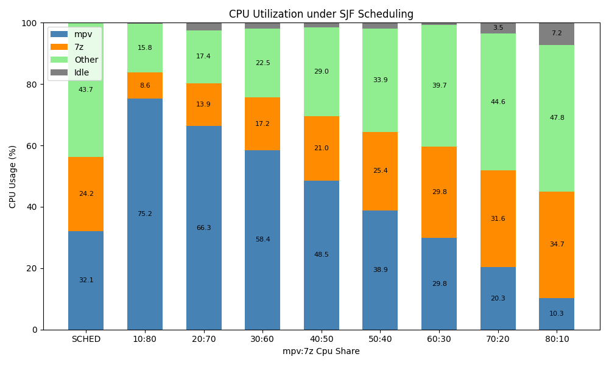
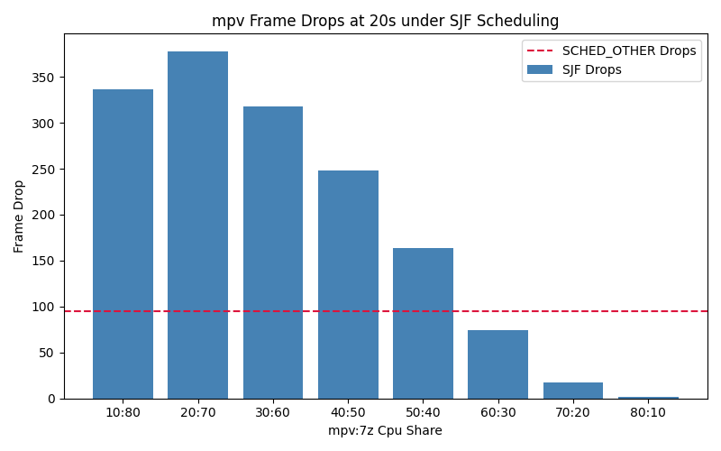
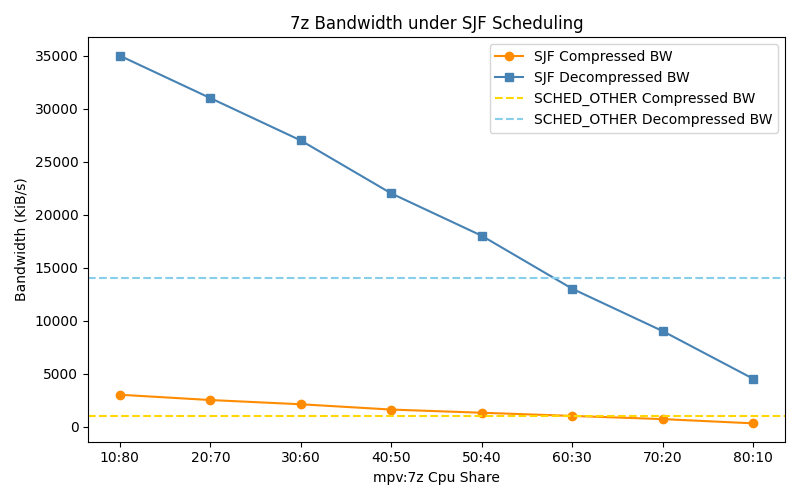

RTS Project 1
---

> R12944024 王行悌
> R13922163 蕭泓佐

>  Due to the large number of experimental screenshots (dozens), we did not include them all in this report.
> - **Raw execution screenshots** are stored in the `log_images/` directory.
> - **Processed analysis charts** are saved in the `analysis_images/` directory.

## Environment Setup
- VirtualBox: [Download](https://www.virtualbox.org/wiki/Downloads)
- Ubuntu 20.04 LTS (or newer): [Download](https://ubuntu.com/download/desktop)
- VM Spec:
  - Memory: 4096 MB
  - Disk: 64 GB
  - CPU: 1 core (i9-10900X CPU)

## Experiment Configuration

### Workload
Two workloads were selected to evaluate the real-time performance of the system:
- **CPU-intensive Benchmark:**
  ```bash
  $ 7z b 10000 -md16
  ```
- **Latency-sensitive Video Playback:**
  ```bash
  $ mpv --loop=inf --geometry=1280x720 --vf=fps=24 <video_file>
  ```
  
### Observation Metrics
The following metrics and tools were used to monitor and verify system behavior:
- **7z Bandwidth**: Measured to evaluate computational throughput under different scheduling conditions.
- **mpv Frame Drops**: Indicates latency performance and responsiveness of the system during CPU contention.
- **CPU Utilization and Idle Rate**: These were used to check CPU saturation and overall system load.
  ```bash
  $ top
  $ mpstat 5
  ```
- **Scheduling Verification**: Used to confirm that real-time scheduling parameters were correctly applied and recognized by the kernel.
  ```bash
  $ sudo chrt -p $(pgrep <name>)
  $ sudo dmesg | grep "SCHED_DEADLINE"
  ```

## Shortest Job First

### Kernel Code Modification
To validate the Shortest Job First (SJF) behavior in the real-time scheduler, we modified the kernel's scheduling policy. Specifically, the `__dl_less()` function, which originally implements Earliest Deadline First (EDF), was altered to prioritize tasks based on their remaining runtime:

```c
static inline bool __dl_less(struct rb_node *a, const struct rb_node *b)
{
    // EDF
    // return dl_time_before(__node_2_dle(a)->deadline, __node_2_dle(b)->deadline);
    // SJF
    return __node_2_dle(a)->runtime < __node_2_dle(b)->runtime;
}
```

### Experiment 1
We fixed the CPU utilization cap to **90%** with a period of **100000**, and varied the `mpv:7z` runtime ratio. We observed:
- `mpv` frame drops (at 20s)
- `7z` throughput
- CPU utilization

**Observations**
- **High CPU utilization**
  - CPU was mostly fully used. 
  - **Idle time appeared only when `mpv` was allocated >70%**, likely because `mpv` couldn't fully consume its quota.
- **`7z` consumes all allocated time; `mpv` does not**  
  - `7z` is a CPU-bound task and efficiently uses all its reserved runtime.  
  - `mpv` has lower workload density and often finishes early, even with large quota.
- **Performance follows allocation**  
  - More CPU to `mpv`: fewer frame drops  
  - More CPU to `7z`: higher bandwidth

  <br>

  <br>

  <br>

### Experiment 2
We fixed the CPU utilization cap to **90%** and set a constant runtime ratio: **7z:mpv = 45% : 45%**. We varied the scheduling period using:

$$
\text{period} \in [10^5, 10^6, 10^7]
$$

**Observations**
- Both `mpv` frame drops and `7z` throughput showed **less than 5% variation** across different period values. No significant impact was observed on either workload.
- This result is reasonable. In Linux's scheduler, the kernel maintains **remaining runtime**, so the scheduling behavior is based on CPU usage ratio rather than the length of the period.

### Experiment 3
Under the SJF policy, tasks with smaller runtime are prioritized. By keeping the **same CPU share ratio** (e.g., `mpv:7z = 10:80`), we can adjust **priority** by changing the `runtime` values:

```bash
# mpv gets higher priority (smaller runtime)
$ sudo chrt --deadline --sched-runtime 10000 --sched-deadline 100000 --sched-period 100000 -p $(pgrep mpv)
$ sudo chrt --deadline --sched-runtime 8000000 --sched-deadline 10000000 --sched-period 10000000 -p $(pgrep 7z)

# 7z gets higher priority (smaller runtime)
$ sudo chrt --deadline --sched-runtime 1000000 --sched-deadline 10000000 --sched-period 10000000 -p $(pgrep mpv)
$ sudo chrt --deadline --sched-runtime 80000 --sched-deadline 100000 --sched-period 100000 -p $(pgrep 7z)
```

To make the effect of priority more observable, we used a low CPU share for mpv (**mpv:7z = 10:80**). This ensures that reducing mpv's runtime significantly increases its priority under SJF.

**Observations**
- In a full video playback (1:45), giving **mpv higher priority** reduced frame drops from **1898** to **1570**.
- The **7z throughput remained largely unchanged**.

## Earliest Deadline First

### Experiment
As a comparison to SJF, we conducted a set of experiments under **Earliest Deadline First (EDF)** scheduling.

We reused the runtime ratios validated in previous experiments, including:

- **From Experiment 1**:  
  We tested share ratios of `mpv:7z = 50:40`, `60:30`, `70:20`, and `80:10`, with total CPU usage fixed at 90%.
- **From Experiment 3**:  
  We applied the same idea of controlling task priority.  
  Instead of using smaller `runtime` (as in SJF), **EDF prioritizes tasks with smaller `deadline`**.

  ```bash
  # mpv gets higher priority (smaller deadline)
  sudo chrt --deadline --sched-runtime 10000 --sched-deadline 100000 --sched-period 100000 -p $(pgrep mpv)
  sudo chrt --deadline --sched-runtime 8000000 --sched-deadline 10000000 --sched-period 10000000 -p $(pgrep 7z)
  
  # 7z gets higher priority (smaller deadline)
  sudo chrt --deadline --sched-runtime 1000000 --sched-deadline 10000000 --sched-period 10000000 -p $(pgrep mpv)
  sudo chrt --deadline --sched-runtime 80000 --sched-deadline 100000 --sched-period 100000 -p $(pgrep 7z)
  ```

**Observations**
- Under different `mpv:7z` share ratios, EDF showed similar behavior to SJF:
  - Frame drops decreased as `mpv` received more CPU time.
  - `7z` throughput decreased proportionally.
- When `mpv` was assigned a **smaller deadline (higher EDF priority)**:
  - Frame drops decreased.
  - `7z` performance was mostly unaffected.
